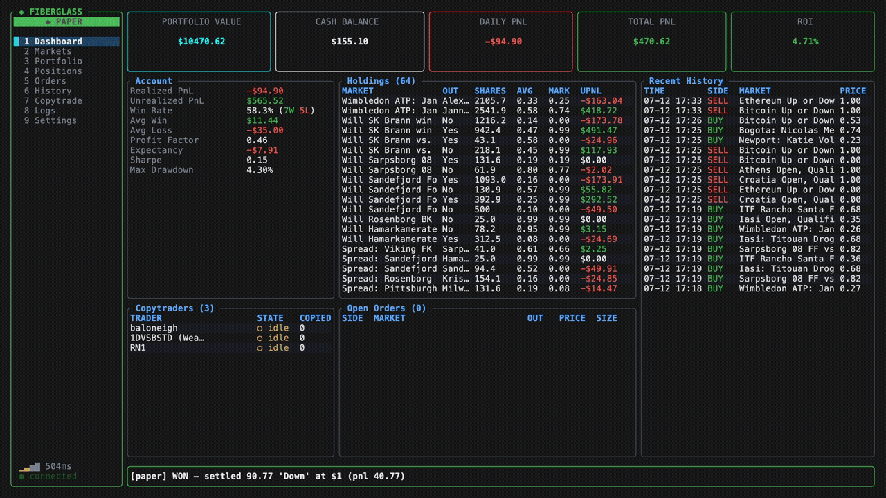

# fiberglass

a ground up rewrite of the polymarket cli built for AI agent support and backtesting with paper trading. supported on all macs, windows, and linux



[](https://github.com/jesodium/fiberglass/actions/workflows/ci-macos.yml?query=branch%3Amain)

[](https://github.com/jesodium/fiberglass/actions/workflows/ci-linux.yml?query=branch%3Amain)

[](https://github.com/jesodium/fiberglass/actions/workflows/ci-windows.yml?query=branch%3Amain)

## Use your own money at your own risk!
The live mode has not been tested yet; if you lose your money, it's your problem.

## install

```bash
# homebrew
brew tap jesodium/fiberglass https://github.com/jesodium/fiberglass
brew install fiberglass

# or the install script
curl -sSL https://raw.githubusercontent.com/jesodium/fiberglass/main/install.sh | sh

# or from source
git clone https://github.com/jesodium/fiberglass
cd fiberglass
cargo install --path .
```

## the TUI

main way to use it:

```bash
fiberglass tui            # live mode, needs a wallet
fiberglass tui --paper    # paper mode, $10k fake money, no wallet
```

## config

your configuration is in `~/.config/polymarket/` your wallet, settings, paper account, etc your private key goes in the OS keychain (macOS Keychain,
Windows Credential Manager, Linux Secret Service). on a headless box with no
keychain, it falls back to a plaintext file (`0600`, owner-only) keep that
machine locked down, or pass the key via `POLYMARKET_PRIVATE_KEY` / `--key`
to keep it off disk entirely.

see [changelog.md](CHANGELOG.md) for what changed.

## why local

- **your keys never leave your machine**: private key sits in the OS keychain, orders go straight to polymarket. no middleman server, no third party holding your funds.
- **fast + direct**: native rust talking one-on-one to the polymarket API, no browser tab or proxy in the path.
- **private**: nobody sees your positions or strategy but you.

## architecture

four entry points share the same core (all dispatched from `main.rs`):

| entry | what |
|-------|------|
| **TUI** (`tui/`) | primary interface, 9 tabs, async render loop, background refresh |
| **CLI** (`commands/`) | 20+ scriptable subcommands (run a 24/7 copytrader on a pi) |
| **shell** (`shell.rs`) | line-based REPL that parses into the same subcommands |
| **MCP** (`mcp/`) | JSON-RPC 2.0 over stdio for AI agents; each tool call re-invokes the binary so paper/live behaviour matches the CLI exactly |

paper mode (`--paper`) runs the same flows against live quote feeds with a local JSON store, no wallet needed. live mode needs a configured key and approved allowances.

## some things that were interesting to build

- **paper/live parity**: the MCP server shells out to the binary per tool call, so an AI agent hits the identical code path a human does. no separate mock layer to drift out of sync.
- **file contention across entry points**: TUI, CLI, and MCP can all touch the paper account on disk at once; the TUI reloads if the store moves ahead so out-of-band trades show up live.
- **settling markets headless**: resolving positions off gamma outcome prices when the CLOB winner flag lags and the book 404s.

## support

fiberglass is free and open source and runs on donations. if it's useful to you:

[](https://buymeacoffee.com/chromium) a donation keeps it maintained. starring the repo helps too.

## images


## stars

[](https://star-history.com/#jesodium/fiberglass&Date)

## license

GPL-3.0-or-later. See [LICENSE](LICENSE). You may use, modify, and redistribute,
but derivatives must stay open under the same license. No warranty — see §15–17.

# ai usage
ai was used in the making of this project (claude code)
